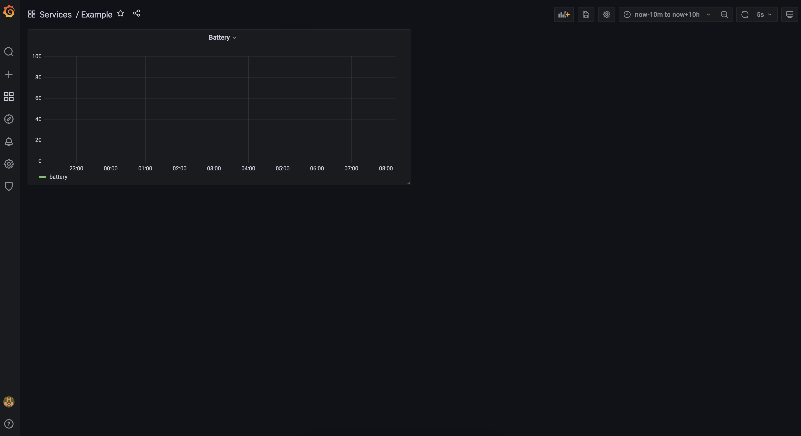
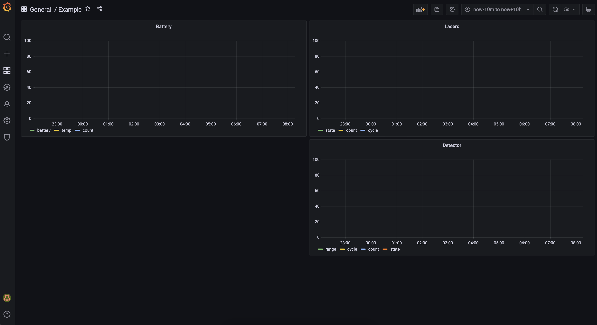
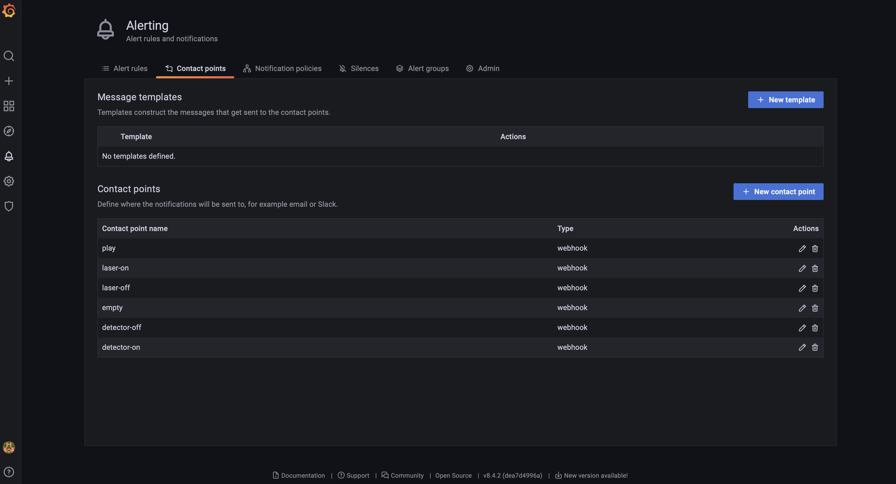
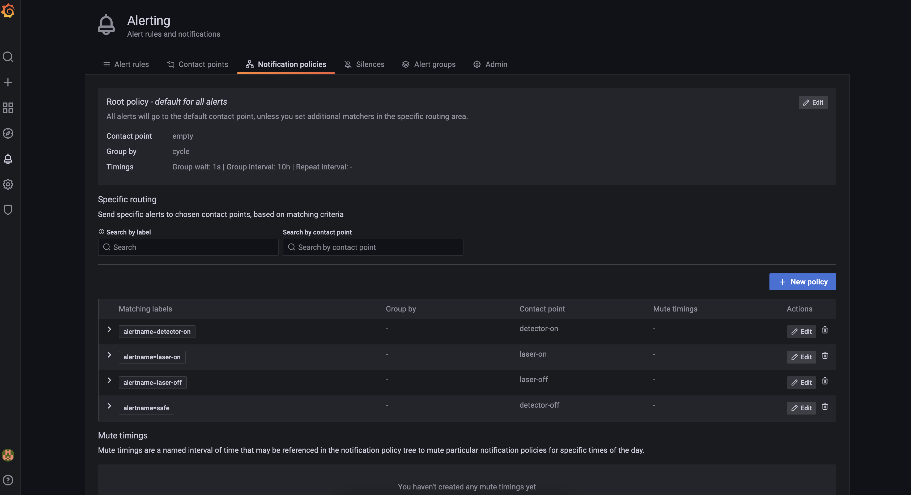
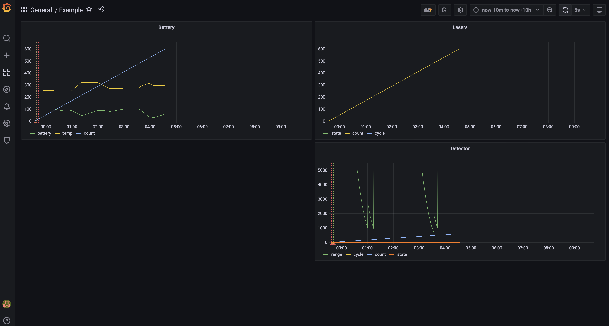

# Red Alert

## Challenge info:

> Someone is junking up our orbits again. We've upgraded the space lasers from HAS2 to the new Femptosecond Laser Automated Gun system. Now you dont need to tell the lasers where to fire, you just need to activate the debris detection system and the lasers will automatically shoot down debris. Careful though, the debris detector and the lasers use a lot of power and generate a lot of heat!

Grafana has access to the API through our internal network. Available commands:

```
http://groundstation:5000/laser-on
http://groundstation:5000/laser-off
http://groundstation:5000/detector-on
http://groundstation:5000/detector-off
http://groundstation:5000/play
```

Use the `play` API command to start the game.

Grafana username: `admin`

Grafana password: `spacemath`

### Connecting

`nc red_alert.satellitesabove.me 5100`

------

After connecting we get the ip and port from Grafana. Enter username and password and go to dashboards to see what we have.



We have dashboard with one panel. In the edit menu we can see that there are 3 tables in PostgreSQL: `cdh`,`laser` and `detector`. Let's make one big dashboard to see everything at the same time.



Now let's dig about some internal addresses we got in the task. We can look at the name of the task and see a big hint. Since Grafana is used for application monitoring it has various mecahnisms for sending alerts. Of course it can send alerts through webhooks, so we can use alerts for making requests to internal API. 

In the Alerts section we already got all Contact Point and Notification Policies.





If we send test notification to `play` endpoint, for example, then a small game will begin in which it will be necessary to control the satellite and not let the debris bring it down. From the task we know that detector and lasers use a battery. After some test runs I found that laser will destory junk on range 1000. Also that we will lose if we don't destory the junk, we will lose if we run out of battery and we will lose if satellite got overheated. 

At this point we got two ways: start the game and manage lasers and detector manually or setup some alerts that will manage our defence system in at the right way.

We will create 5 alerts: for on/off detector and on/off lasers. Detector will be enabled if battery has charge more than 65 percents and disabled if battery has less than 65 percents. Lasers will be enabled if the distance to junk is less than 2000 and disabled if distance to junk is more then 3000 or temperature is more than 330. After sending test notification to `play` endpoint and waiting for some time we can see what happend at dashboard.



We can see that there were 4 junks, also we didn't overheat and got some battery left. After destroing 4 junks and waiting for some more time we got message that we survived in connection and flag:

```
groundstation | You survived!
groundstation | flag{quebec719336zulu3:GFVHIdkxhqefMoKPaBfWdJTAQwxA-Rv7byQvEhSOGaqsEj4yjd630hKPKqIw_VgIoJ-3kQGs1RZZbO1e3Cm_QI4}
```

### Flag:

> `flag{quebec719336zulu3:GFVHIdkxhqefMoKPaBfWdJTAQwxA-Rv7byQvEhSOGaqsEj4yjd630hKPKqIw_VgIoJ-3kQGs1RZZbO1e3Cm_QI4}`